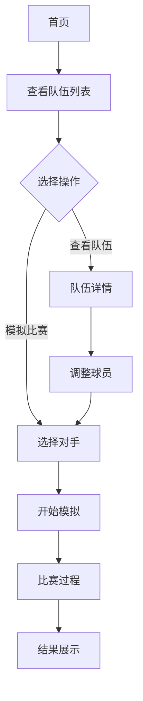

## 1. Product Overview
世界杯预测软件是一款模拟足球比赛的工具，允许用户导入参赛队伍、调整球员阵容、模拟比赛并得出预测结果。
- 帮助足球爱好者体验世界杯赛事模拟的乐趣
- 提供真实的数据支持和模拟算法，增强预测准确性

## 2. Core Features

### 2.1 User Roles
| Role | Registration Method | Core Permissions |
|------|---------------------|------------------|
| User | No registration required | View teams, adjust players, simulate matches |

### 2.2 Feature Module
1. **队伍管理**: 导入和管理世界杯参赛队伍
2. **球员调整**: 调整每支队伍的球员阵容
3. **比赛模拟**: 选择队伍进行比赛模拟
4. **结果展示**: 展示比赛结果和统计数据

### 2.3 Page Details
| Page Name | Module Name | Feature description |
|-----------|-------------|---------------------|
| 首页 | 队伍列表 | 展示所有参赛队伍，支持搜索和筛选 |
| 首页 | 队伍详情 | 查看队伍信息、球员阵容 |
| 球员调整 | 阵容管理 | 调整首发11人、替补球员 |
| 比赛模拟 | 比赛选择 | 选择两支队伍进行模拟比赛 |
| 比赛模拟 | 比赛过程 | 实时展示比赛进程和事件 |
| 结果展示 | 比赛结果 | 展示比分、统计数据、最佳球员 |

## 3. Core Process
用户进入首页查看队伍列表 → 选择队伍查看详情 → 调整球员阵容 → 选择两支队伍进行比赛模拟 → 查看比赛结果

## 4. User Interface Design

### 4.1 Design Style
- 主色调: 深绿色 (#0D4F3C) 搭配白色和金色点缀
- 按钮样式: 圆角矩形，悬停时有阴影效果
- 字体: 现代无衬线字体，标题使用粗体
- 布局: 卡片式设计，清晰的信息层级
- 图标: 使用足球相关图标，简洁现代

### 4.2 Page Design Overview
| Page Name | Module Name | UI Elements |
|-----------|-------------|-------------|
| 首页 | 导航栏 | Logo、标题、导航链接 |
| 首页 | 队伍卡片 | 国旗、队名、世界排名、球队实力 |
| 队伍详情 | 阵容展示 | 球员头像、位置、能力值 |
| 比赛模拟 | 比赛界面 | 球场背景、队伍信息、比分显示 |
| 结果展示 | 统计面板 | 控球率、射门次数、传球成功率 |

### 4.3 Responsiveness
- 桌面端优先设计
- 移动端自适应布局
- 触摸友好的交互元素

### 4.4 3D Scene Guidance
- 比赛模拟界面使用2D足球场背景
- 球员位置用图标表示
- 进球动画效果