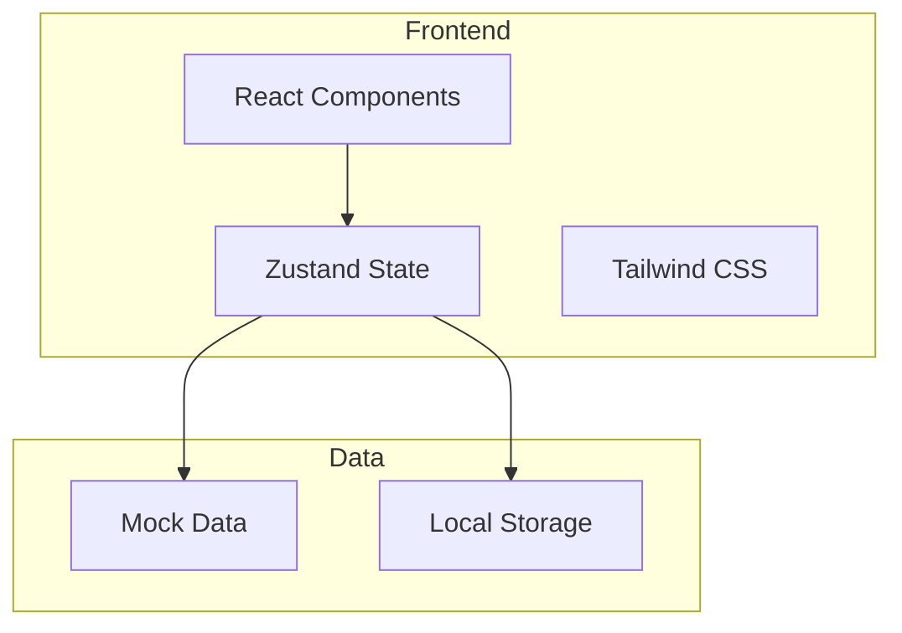
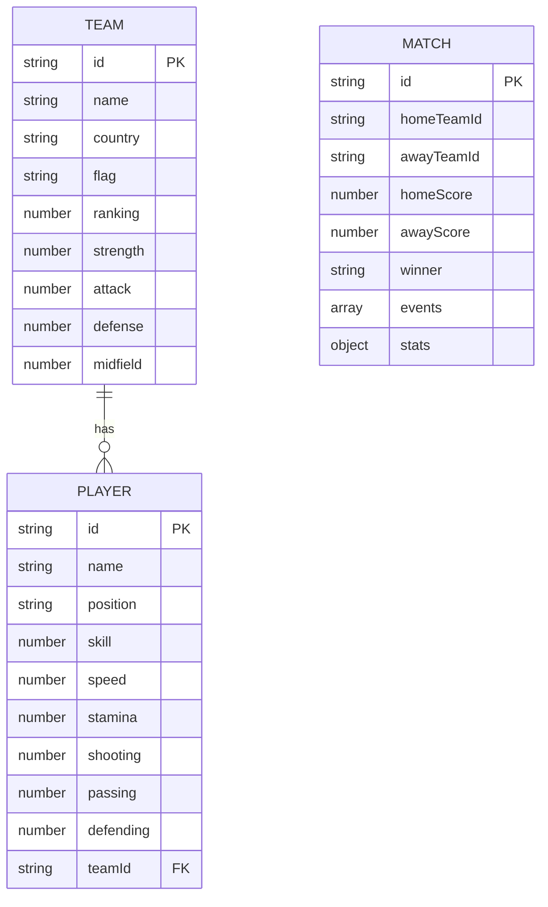

## 1. Architecture Design



## 2. Technology Description
- Frontend: React@18 + TypeScript + tailwindcss@3 + vite
- Initialization Tool: vite-init
- Backend: None (纯前端应用)
- State Management: Zustand
- Icons: lucide-react

## 3. Route Definitions
| Route | Purpose |
|-------|---------|
| / | 首页 - 队伍列表 |
| /team/:id | 队伍详情页 |
| /simulate | 比赛模拟页 |
| /result | 比赛结果页 |

## 4. API Definitions
无后端API，使用本地Mock数据

## 5. Data Model

### 5.1 Data Model Definition



### 5.2 Data Definition

#### Team 接口
```typescript
interface Team {
  id: string;
  name: string;
  country: string;
  flag: string;
  ranking: number;
  strength: number;
  attack: number;
  defense: number;
  midfield: number;
  players: Player[];
}
```

#### Player 接口
```typescript
interface Player {
  id: string;
  name: string;
  position: 'GK' | 'DF' | 'MF' | 'FW';
  skill: number;
  speed: number;
  stamina: number;
  shooting: number;
  passing: number;
  defending: number;
}
```

#### MatchResult 接口
```typescript
interface MatchResult {
  id: string;
  homeTeam: Team;
  awayTeam: Team;
  homeScore: number;
  awayScore: number;
  winner: string;
  events: MatchEvent[];
  stats: MatchStats;
}
```

#### MatchEvent 接口
```typescript
interface MatchEvent {
  minute: number;
  type: 'goal' | 'yellow_card' | 'red_card' | 'substitution';
  player: string;
  team: string;
  description: string;
}
```

#### MatchStats 接口
```typescript
interface MatchStats {
  homePossession: number;
  awayPossession: number;
  homeShots: number;
  awayShots: number;
  homeShotsOnTarget: number;
  awayShotsOnTarget: number;
  homePassAccuracy: number;
  awayPassAccuracy: number;
}
```

## 6. Project Structure
```
src/
├── components/
│   ├── TeamCard.tsx
│   ├── TeamList.tsx
│   ├── PlayerCard.tsx
│   ├── PlayerList.tsx
│   ├── MatchSimulator.tsx
│   ├── MatchResult.tsx
│   └── Navigation.tsx
├── pages/
│   ├── HomePage.tsx
│   ├── TeamDetailPage.tsx
│   ├── SimulatePage.tsx
│   └── ResultPage.tsx
├── store/
│   └── gameStore.ts
├── data/
│   └── mockData.ts
├── utils/
│   └── matchSimulator.ts
├── types/
│   └── index.ts
├── App.tsx
├── main.tsx
└── index.css
```